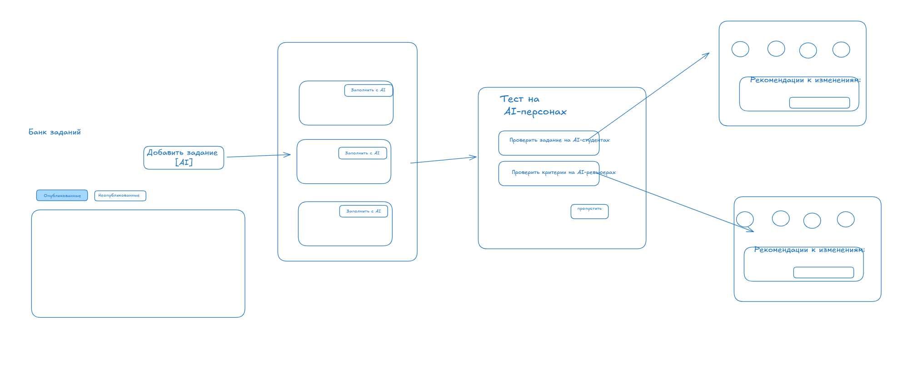
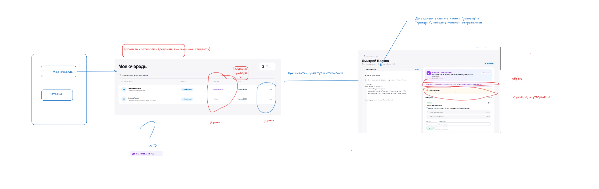
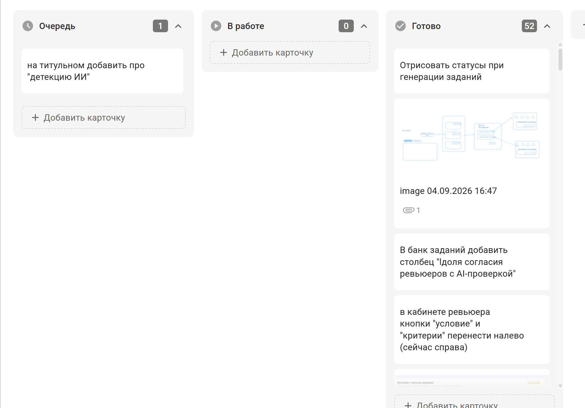

# Реализованный MVP, пользовательский сценарий и вклад AI Product

**Финальная версия продуктовых материалов · 06.09.2026**

## Границы реализованного MVP

Фокус прототипа — **направление Data Science**, сдача работы **ссылкой на GitHub** и демонстрация полного цикла в веб-сервисе.

### Рабочее ядро прототипа

| Компонент | Что реализовано |
|---|---|
| **Единый кабинет** | Интерфейсы студента, ревьюера и методиста, статусы, очереди и переходы между основными действиями |
| **Хранение и API** | База данных и API core-сервиса для сущностей курса, заданий, сдач, пользователей и результатов |
| **Распределение ревьюеров** | Детерминированное назначение по специализации и суммарному весу работ; очередь из 24 работ распределяется автоматически |
| **AI-ревью** | Покритериальный разбор, рекомендуемые баллы, обоснования, цельный student-facing фидбэк и отдельные подсказки ревьюеру |
| **Проверка на AI** | Анализ 14 признаков и три прогона модели с итогом по большинству; результат интерпретируется как `HUMAN`, `HUMAN + AI ASSISTED` или `AI-GENERATED`, показываются основания, а пограничный случай ведёт к уточняющему вопросу, а не к санкции |
| **Проверка понимания** | AI формирует вопросы по конкретному решению; ревьюер выбирает, редактирует или задаёт свой вопрос |
| **Конструктор заданий** | Из идеи формируются условие, критерии и разбалловка; отдельные блоки можно улучшать и принимать поэтапно |
| **AI-персоны** | Четыре виртуальных профиля решают задание, AI-ревьюеры оценивают ответы по критериям, критик ищет неоднозначности и формирует рекомендации |

### Что показано на demo-данных или остаётся за границей MVP

- аналитические дашборды и история потоков используют синтетические данные, потому что реальная история курса и интеграции не были доступны;
- полноценная интеграция со Stepik, корпоративной авторизацией и всеми форматами сдачи не выполнена;
- сигналы об улучшении курса ещё не замыкают автоматический цикл обновления материалов: решение и изменение контента делает методист;
- AI-персоны не заменяют тест на реальных студентах;
- AI не выставляет необратимую итоговую оценку, не обвиняет студента и не применяет санкции автоматически;
- сравнение новой работы с персональным портфелем предыдущих работ студента оставлено как идея полной версии.

## Основной сквозной сценарий

1. **Методист** создаёт черновик задания: задаёт цель и исходную формулировку либо просит AI дополнить условие, критерии и разбалловку.
2. Методист последовательно запускает тест на AI-студентах и проверку критериев на AI-ревьюерах. Система показывает ответы, оценки и рекомендации; каждую правку можно применить, отредактировать или отклонить.
3. Подтверждённая версия сохраняется в банке заданий как черновик и после решения методиста публикуется в курс.
4. **Студент** открывает задание, прикладывает ссылку на GitHub и отправляет работу.
5. Система регистрирует сдачу и автоматически назначает **ревьюера** с учётом специализации и нагрузки.
6. AI выполняет покритериальный разбор, готовит баллы, объяснения, обратную связь студенту и отдельную панель внимания ревьюера.
7. Параллельно система ищет признаки AI-генерации. Она показывает не обвинение, а объяснимый сигнал и уровень согласия прогонов.
8. Если результат пограничный или есть риск непонимания, AI предлагает вопросы по конкретному коду. Ревьюер выбирает один, редактирует его или пишет свой.
9. Ревьюер подтверждает, исправляет или отклоняет AI-рекомендации и принимает итоговое решение.
10. Студент видит статус, оценку и обратную связь; при необходимости отвечает на дополнительный вопрос.
11. **Методист** видит состояние очереди и исключения. Правки ревьюеров, ошибки и результаты AI-персон сохраняются как будущие сигналы для улучшения критериев, заданий и материалов курса.

## Как продуктовые решения повлияли на техническую реализацию

| Исследовательский вывод | Продуктовое решение | Влияние на реализацию |
|---|---|---|
| Работа распределена между Stepik, GitHub, таблицами и переписками | Один продукт для трёх ролей | Общая модель данных, core API и отдельные ролевые интерфейсы вместо независимых демо-функций |
| Методисту важен контроль всего потока | Статусы, очередь, сроки и исключения видны в кабинете | Сущности сдачи, назначения и статуса связаны в одном сценарии |
| Ревьюеру нужна экономия рутины, но не потеря контроля | AI формирует черновик, reviewer принимает решение | В интерфейсе предусмотрены approve/edit/reject, а student-facing фидбэк отделён от внутренних подсказок |
| Прозрачность обратной связи особенно важна Авито | Оценка строится отдельно по каждому критерию | Структурированный ответ через Pydantic; для вывода сохраняются обоснования и фрагменты работы |
| Не всякая AI-помощь означает отсутствие знаний | Сигнал AI запускает проверку понимания | Детектор не связан с автоматическим наказанием; отдельный шаг генерирует вопросы по решению |
| Ручная очередь ломается при несдачах и отсутствии ревьюеров | Автоматическое назначение, методист решает исключения | Детерминированный алгоритм вместо LLM: быстрее, бесплатно, объяснимо и проще в поддержке |
| Новые задания дорого тестировать на людях | Предварительный прогон на AI-персонах | Отдельный агентный контур в LangGraph с ролями студента, ревьюера и критика |
| У команды нет штатной поддержки собственного ML-контура | Использовать заменяемые managed LLM | LiteLLM отделяет бизнес-логику от конкретного провайдера; версии прогонов можно наблюдать в Langfuse |
| Аналитике нужны реальные события, которых пока нет | Не имитировать доказанный эффект | Дашборды явно маркированы как demo; архитектура предусматривает накопление событий после пилота |

## Вклад AI Product

AI Product отвечал за то, чтобы прототип был не набором AI-функций, а цельным продуктом, основанным на подтверждённых проблемах.

### Discovery и продуктовая концепция

- разобраны кейс и примеры работ;
- проведены и структурированы интервью с продюсером образовательных проектов и действующим методистом-ревьюером;
- описан AS IS, выделены пользователи, JTBD, боли и ограничения процесса;
- сформулированы гипотеза, ценностное предложение и принцип human-in-the-loop;
- обязательные требования кейса объединены с собственными идеями команды и приоритизированы в границы MVP;
- сформированы измеримые критерии успеха и отделены подтверждённые результаты от гипотез пилота.

### Роль «хипстера»: UX и пользовательские потоки

AI Product проектировал и итерационно улучшал пользовательский опыт:

- объединил **банк заданий** и **AI-конструктор** в один последовательный поток без переключения между разделами;
- спроектировал пошаговый сценарий «идея → задание и критерии → AI-персоны → рекомендации → черновик»;
- переработал кабинет ревьюера: разделил очередь и историю, добавил сортировку по сроку, типу задания и студенту, сделал открытие карточки из строки;
- разделил обратную связь студенту и внутренние подсказки ревьюеру, чтобы интерфейс поддерживал разные решения и уровни ответственности;
- убрал или переименовал неоднозначные элементы, вынес условие и критерии в доступные по месту проверки блоки;
- проверял согласованность экранов с общим позиционированием: AI выполняет рутину, а эксперт контролирует результат.

### Управление разработкой через канбан

Продуктовые решения переводились в отдельные задачи для разработчиков и планировались на канбан-доске со статусами **«Очередь → В работе → Готово»**. Карточки содержали конкретное изменение интерфейса или логики, ожидаемый пользовательский результат и визуальный референс. Это позволило:

- синхронизировать параллельную разработку core-платформы и AI-конструктора;
- не терять продуктовые правки во время быстрого прототипирования;
- видеть текущий объём, приоритеты и готовность функций;
- быстро возвращать результаты тестирования и просмотра интерфейса в следующий цикл разработки.

### Распределение ответственности в команде

| Участник | Роль | Зона ответственности |
|---|---|---|
| **Анна Курдина** | AI Product | Исследования и интервью, концепция, пользовательские потоки и UX, приоритизация MVP, постановка и координация задач через канбан, продуктовая проверка |
| **Никита Кошелев** | AI Engineer | Core-платформа, база данных и API, AI-проверка работ и детекция AI |
| **Иван Чернов** | AI Engineer | Кабинеты пользователей, AI-профили студентов, AI-генерация и инструменты методиста |

## Использованный стек

**FastAPI, LangGraph, LiteLLM, Docker, Langfuse, Pydantic; модели z-ai и Gemini 3.7 Flash.**
