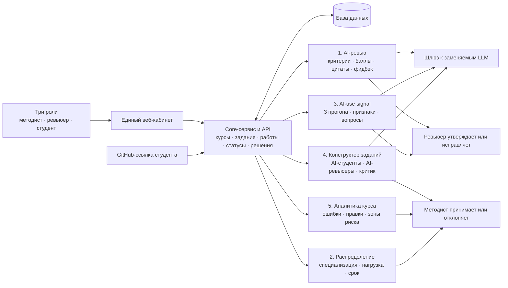

# Архитектура Avito AI Reviewer

**Финальная версия · 06.09.2026**

- **Прототип:** [http://212.41.9.84:8089/](http://212.41.9.84:8089/)
- **Исходный код:** [https://github.com/AnutKu/Avito-AI-Reviewer](https://github.com/AnutKu/Avito-AI-Reviewer)

## Архитектурный принцип

Платформа разделена на общее ядро и пять независимых функциональных контуров. Ядро хранит единое состояние курса, а AI-модули решают узкие задачи и возвращают структурированные рекомендации. Это позволяет заменять модели и дорабатывать отдельные функции без пересборки всего продукта.

## Как движутся данные

1. **Методист** создаёт задание, критерии, разбалловку и правила курса.
2. **Студент** отправляет GitHub-ссылку; сервис фиксирует сдачу и получает доступное содержимое работы.
3. **Алгоритм распределения** назначает подходящего ревьюера и сохраняет текстовое основание назначения.
4. **AI-ревью** сопоставляет работу с каждым критерием и возвращает баллы, основания, фрагменты работы и черновик обратной связи.
5. **AI-use contour** выполняет три независимых прогона одной модели, агрегирует результат по большинству и сохраняет конкретные признаки.
6. При спорном сигнале **генератор вопросов** формирует вопросы по конкретному решению студента.
7. **Ревьюер** подтверждает, редактирует или отклоняет рекомендации. Только его решение становится итогом для студента.
8. События, оценки, правки и сроки сохраняются для **аналитики курса** и будущего улучшения критериев, заданий и материалов.

## Пять контуров

| Контур | Что делает | Почему реализован именно так |
|---|---|---|
| **AI-ревью** | Даёт покритериальный разбор, рекомендуемые баллы, цитаты, фидбэк студенту и внутренние подсказки | Структурированный результат делает оценку прозрачной и позволяет человеку проверить конкретные основания |
| **Распределение ревьюеров** | Назначает работу по специализации, суммарной трудоёмкости и доступному лимиту | Детерминированные правила предсказуемее и дешевле LLM для операционной задачи |
| **AI-use signal и вопросы** | Классифицирует сигнал в три класса, объясняет основания и предлагает вопросы на понимание | Происхождение кода нельзя надёжно доказать, поэтому сигнал используется для дополнительной проверки, а не санкции |
| **Конструктор и AI-персоны** | Разворачивает идею в задание и критерии; четыре профиля решают задание, AI-ревьюеры оценивают, критик ищет неоднозначности | Даёт быстрый предварительный тест до дорогого прогона на реальных студентах |
| **Аналитика курса** | Агрегирует успеваемость, повторяющиеся ошибки, правки ревьюеров и задержки | Маленькой команде нужен готовый сигнал о проблеме, а не дополнительная ручная аналитическая работа |

## Где встроен human-in-the-loop

- AI не публикует задание без решения методиста.
- AI не отправляет оценку и обратную связь без решения ревьюера.
- Ревьюер может принять, изменить или отклонить вывод по каждому критерию.
- Признак AI-генерации не снижает балл автоматически.
- Ревьюер выбирает, редактирует или создаёт вопрос студенту.
- Методист решает исключения распределения и принимает решения по улучшению курса.

## Предусмотренные и сниженные риски

| Риск | Архитектурное решение |
|---|---|
| Ревьюер формально принимает всё подряд | Показываются основания, спорные фрагменты и отдельные действия approve/edit/reject; решения логируются |
| Балл извлекается из свободного текста | Критерии и правила задаются структурированно; выход модели валидируется схемой данных |
| Один ревьюер перегружен, другой свободен | Нагрузка считается по суммарной трудоёмкости активных работ, а не только по их количеству |
| Модель или провайдер меняется | AI-вызовы проходят через единый шлюз; модель можно заменить без изменения бизнес-логики |
| Невозможно понять, почему система решила именно так | Для оценки, назначения и AI-сигнала сохраняются основания и связанные фрагменты |

## Риски, которые остаются

- **AI-use signal не является доказательством.** Возможны ложные срабатывания; автоматические санкции запрещены продуктовой логикой.
- **Качество ревью зависит от качества критериев.** Нечёткий критерий может привести к убедительному, но неверному выводу.
- **LLM недетерминированы.** Нужны версионирование, логирование и регулярная проверка на golden set.
- **AI-персоны не равны реальным студентам.** Они используются только как предварительный фильтр.
- **Код и данные могут содержать prompt injection.** Для промышленной версии нужны изоляция контента, ограничения форматов и размеров, сканирование входных данных.
- **Конфиденциальность.** Перед пилотом необходимо согласовать провайдеров моделей, доступы, минимизацию данных, сроки хранения и удаление.
- **Аналитика пока демонстрационная.** Реальные выводы появятся после накопления событий на пилоте.

## Техническая реализация

- **API и core-сервис:** FastAPI, Pydantic;
- **оркестрация агентных сценариев:** LangGraph;
- **единый шлюз к моделям:** LiteLLM;
- **наблюдаемость AI-вызовов:** Langfuse;
- **развёртывание:** Docker;
- **модели прототипа:** z-ai / GLM-5.3-Flash и Gemini 3.7 Flash.

Архитектура рассчитана на расширение источников сдачи и курсов: для этого потребуется добавить интеграции и настройки, но не менять принцип решения.

